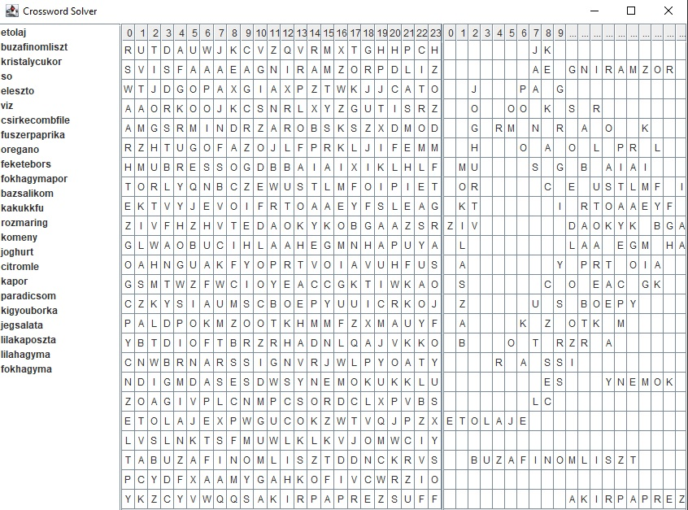

# Crossword Solver (by recursive backtracking algorithm)

This project is a Java-based Crossword Solver that finds words from a grid and visualizes the solution in a graphical interface. The program reads the grid and the words to be found from text files and displays both the initial state and the solution on the GUI, making it easy to see the positions of the found words.

### Key Features:
- **Automated Word Search**: Reads input files for the crossword grid and a list of keywords to find.
- **Flexible Word Matching**: Supports searching in all directions, including mirrored versions of words.
- **Graphical Visualization**: Displays the crossword grid, highlighting found words and showing unmatched words separately.
- **Simple GUI**: Provides an easy-to-use interface for a better user experience, making it accessible to anyone.

This project demonstrates the use of Java Swing for GUI, file handling techniques, as well as efficient searching algorithms, and can be extended to more advanced crossword puzzles or word search games.

### Screenshot

### Usage:
1. Load the crossword grid from `crossword.txt` and the words to be found from `wordsToBeFound.txt`.
2. The application will highlight the words found in the grid through the GUI.

### Technologies:
- **Language**: Java
- **GUI**: Java Swing

Feel free to explore 😊